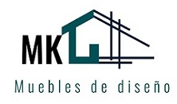

<!-- PROJECT LOGO -->
 

  

  <h3 align="center">Proyect MK Muebles</h3>
 

<!-- ABOUT THE PROJECT -->
## About The Project

This proyect is a ecommerce, creat for the curse the JavaScript in CoderHouse.

(<a href="#readme-top">back to top</a>)

### Built With

* HTML
* CSS
* JavaScript
* Sass
* Bootstrap

(<a href="#readme-top">back to top</a>)

<!-- CONTACT -->
## Contact

Gisela Rios  - gisee_rios@hotmail.com

Project Link: https://desafio-gisela-rios.vercel.app/

(<a href="#readme-top">back to top</a>)

